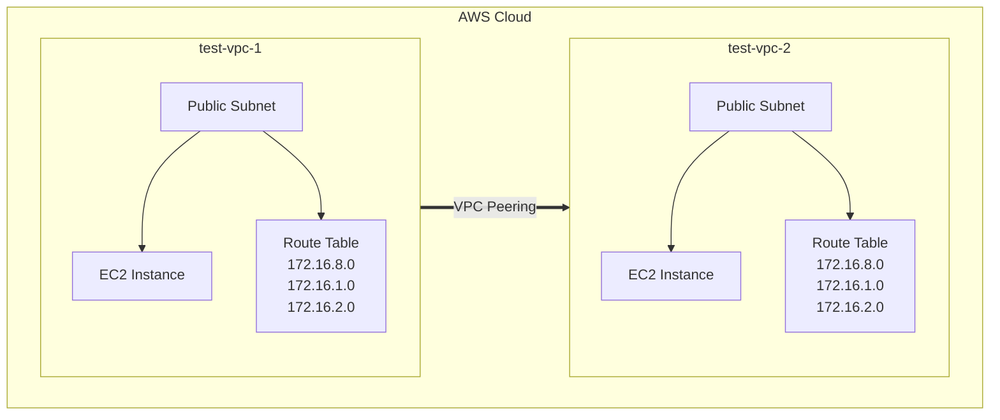

# VPC1 Setup
1. Create Vpc
2. Create Route Table
3. Create subnet
4. Attach Route Table -----> Subnet
5. Create Ec2 Instance (t2.mirco)

# VPC2 Setup
1. Create Vpc
2. Create Route Table
3. Create subnet
4. Attach Route Table -----> Subnet
5. Create Ec2 Instance (t2.mirco)

